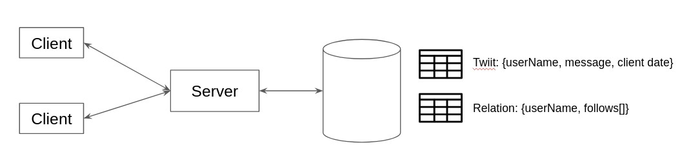

the-social-network
========================

the-social-network is a client-server console application that enables social media by using sockets for communication.

Clients connect to the server to perform the four actions described in the application requirements (publish, consult timeline, follow users, consult wall). The server stores all received sms in a mongo database. In this database, the relationships (follows) that exist between users are also stored. 


* posting: user -> message
* reading: user 
* following: user follows anotheruser
* wall: user wall 

General architecture:



<h2>Launch</h2>

It is not necessary to configure the application, the server is launched on port 8887 and expects to have a MongoDb database on port 27017 (a docker compose to run the database is included) 

Server

```
java -cp the-social-network-1.0-SNAPSHOT-jar-with-dependencies.jar io.github.miguelangelprogramacion.AppMultiServer
```

Client

```
java -cp the-social-network-1.0-SNAPSHOT-jar-with-dependencies.jar io.github.miguelangelprogramacion.AppSocialNetworkClient
```
<h2>Development</h2>

Run test

```
mvn test
```
Run IT test

```
mvn verify
```

Build 

```
mvn package
```

<h2>Tech</h2>

* [Docker](https://www.docker.com/) - Docker version 20.10.7: An open-source project that automates the deployment of Linux applications inside software containers.
* [MongoDB](https://www.mongodb.com/) - MongoDB is a source-available cross-platform document-oriented database program. Classified as a NoSQL database program, MongoDB uses JSON-like documents with optional schemas.  
* [Testcontainers](https://www.testcontainers.org/): Testcontainers is a Java library that supports JUnit tests, providing lightweight, throwaway instances of common databases, Selenium web browsers, or anything else that can run in a Docker container.


<h2>References</h2>

* [Sockets](https://docs.oracle.com/javase/tutorial/networking/sockets/clientServer.html)
